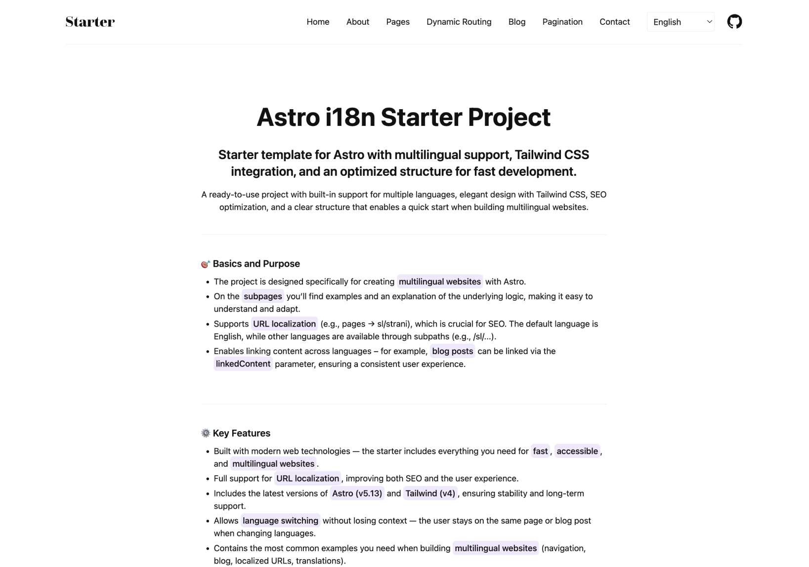

# Astro i18n Starter

> Note about branches: you are viewing the advanced i18n branch.

This README reflects the new branch that introduces a helper-driven approach to URL localization and pagination. The `main` branch remains available for a simpler setup. Choose the branch that best fits your needs:

-   Advanced (this branch: `feat/i18n-routing-helper`): adds `buildLocalizedStaticPaths()` for DRY, localized `getStaticPaths`, integrates i18n with Astro `paginate()`, and improves language switching on blog posts via content linking.
-   Simple (`main`): a more straightforward variant with fewer moving parts.

To check out this branch locally:

```bash
git fetch origin
git checkout feat/i18n-routing-helper
```

---


**Keywords:** `astro` • `i18n` • `internationalization` • `multilingual` • `url localization` • `seo` • `typescript` • `tailwind css` • `static site generation`

## 🌐 [Live Demo - feat/i18n-routing-helper](https://feat-i18n-routing-helper.astro-i18n-starter-cd2.pages.dev)

> Multilingual Astro starter with URL localization support. Complete documentation available at the demo link.

Since Astro doesn't have built-in URL localization out of the box, this starter demonstrates how to implement a complete i18n solution for multilingual projects.

## ✨ Features

This project implements a comprehensive internationalization (i18n) system that includes:

✅ **SEO-friendly URLs** in multiple languages (`/about` → `/sl/o-projektu`)  
✅ **Static generation** at build time with dynamic routing  
✅ **Language-specific content** loading and management  
✅ **Translation system** integration with namespace support  
✅ **Smart language switching** with context preservation  
✅ **Blog system** with multilingual posts and pagination  
✅ **Helper for localized paths** via `buildLocalizedStaticPaths()`  
✅ **Component examples** with Svelte 5 integration  
✅ **Accessibility features** with proper ARIA attributes  
✅ **SEO optimization** with meta tags and keywords

**Perfect for:** Projects requiring complete URL localization alongside content translation



---

## 🛠️ Tech Stack

-   **Framework**: [Astro 5.13](https://astro.build/) - Static site generator
-   **Components**: [Svelte 5](https://svelte.dev/) - Interactive components with runes
-   **Styling**: [Tailwind CSS](https://tailwindcss.com/) - Utility-first CSS
-   **Content**: Astro Content Collections - Type-safe markdown content
-   **Images**: Astro Assets - Optimized image processing

---

## 🚀 Quick Start

### 1. Clone & Install

```bash
# Clone the repository
git clone https://github.com/Scorpio3310/astro-i18n-starter.git
cd astro-i18n-starter

# Install dependencies
pnpm install
```

### 2. Environment Setup

```bash
# Copy environment file
cp .env.example .env

# Edit .env with your production domain
PRODUCTION_DOMAIN = "https://your-domain.com"
```

### 3. Development Server

```bash
# Start development server
pnpm run dev
```

Visit `http://localhost:4321` to see your multilingual site!

---

## 🔀 Branch Overview

-   `feat/i18n-routing-helper`:
    -   `src/i18n/utils.ts` exposes `buildLocalizedStaticPaths(basePath, pattern)` to generate localized `getStaticPaths()` entries for pages, dynamic routes, and catch‑all routes.
    -   Pagination example `[pagination]/[...page].astro` shows Astro `paginate()` working with translated base segments (e.g., `blog-pagination` → `spletni-dnevnik-paginacija`).
    -   `switchLanguageUrl()` powers the Language Picker to keep you on the equivalent blog post or page when changing languages, using `linkedContent` in blog frontmatter.
-   `main` (kept for simpler needs):
    -   Fewer abstractions, suitable if you prefer explicit per-page setup without the helper.

If you want to keep both approaches, keep both branches and reference this README in this branch only.

---

## 📁 Project Structure

```
/
├── public/              # Static assets
├── src/
│   ├── assets/          # Assets
│   ├── components/      # Reusable components
│   ├── content/         # Content collections (blog, authors)
│   ├── data/            # Navigation and configuration
│   ├── i18n/            # Translation utilities and routes
│   ├── layouts/         # Page layouts
│   ├── locales/         # Translation files (en, sl)
│   ├── pages/           # File-based routing with [dynamic] params
│   ├── styles/          # Global styles
│   └── utils/           # Utility functions
```

---

## 🌍 How URL Localization Works

The system uses dynamic routing with file-based structure:

```
English:    /about          → src/pages/[about]/[...index].astro
Slovenian:  /sl/o-projektu  → src/pages/[about]/[...index].astro
```

**Dynamic Path Generation (with helper):**

```astro
---
import { buildLocalizedStaticPaths } from "@i18n/utils";

// [about]/[...index].astro
export function getStaticPaths() {
  // Base path in English + a simple param pattern
  // Pattern: ["about", "...index"] → first segment fills [about], rest fills [...index]
  return buildLocalizedStaticPaths("/about", ["about", "...index"]);
}
---
```

---

## 📝 Adding New Pages

1. **Create page file**: `src/pages/[your-route]/[...index].astro`
2. **Add route translations**: Update `src/i18n/routes.ts`
3. **Add translations**: Create files in `src/locales/en/` and `src/locales/sl/`
4. **Update navigation**: Modify `src/data/navigationData.ts`

Detailed documentation with examples is available in the demo site.

---

## 🔁 Migrating From `main` to This Branch

1. Add or update route translations in `src/i18n/routes.ts` (e.g., `about`, `blog`, `blog-pagination`, dynamic routing segments).
2. Replace manual `getStaticPaths()` mapping with `buildLocalizedStaticPaths()` in localized pages:
    - Example patterns:
        - `"/about"` with `["about", "...index"]` → `[about]/[...index].astro`
        - `"/dynamic-routing"` with `["dyn_routing", "...index"]` → `[dyn_routing]/[...index].astro`
        - `"/dynamic-routing/subpage-2"` with `["dyn_routing", "subpage2", "...index"]` → `[dyn_routing]/[subpage2]/[...index].astro`
3. Pagination: use the example in `src/pages/[pagination]/[...page].astro` that combines `buildLocalizedStaticPaths()` with Astro `paginate()` while preserving translated base segments.
4. Language switching: ensure blog posts that are equivalents across languages share a `linkedContent` value in frontmatter so `switchLanguageUrl()` can map slugs across languages.
5. Verify `src/i18n/ui.ts` settings:
    - `defaultLang` and `showDefaultLang` drive whether the default language has a URL prefix and what the root `/` resolves to.
6. Navigation: update `src/data/navigationData.ts` to use English base `href` values (the helper translates them per language at runtime).

Tip: After migrating, sanity‑check home, about, blog listing, a few posts, pagination pages, and the language picker in both languages.

---

## 🔧 Environment Variables

```bash
# .env
PRODUCTION_DOMAIN = "https://your-domain.com"  # Used to enable robots.txt
```

**Important:** Set your production domain for proper:

-   Open Graph images in social media
-   Canonical URLs for SEO
-   Search engine indexing control

---

## 🚢 Deployment

### Build for Production

```bash
pnpm run build
```

### Preview Build

```bash
pnpm run preview
```

The site generates static files optimized for any hosting provider (Netlify, Vercel, Cloudflare Pages, etc.).

---

## 🤝 Contributing

1. Fork the repository
2. Create a feature branch (`git checkout -b feature/amazing-feature`)
3. Make your changes
4. Test locally with `pnpm run build && pnpm run preview`
5. Commit your changes (`git commit -m 'Add amazing feature'`)
6. Push to the branch (`git push origin feature/amazing-feature`)
7. Open a Pull Request

---

## 📄 License

This project is licensed under the MIT License - see the [LICENSE](LICENSE) file for details.

---

## 🙏 Acknowledgments

-   [Astro](https://astro.build/) - Amazing static site generator
-   [Svelte](https://svelte.dev/) - Excellent component framework
-   [Tailwind CSS](https://tailwindcss.com/) - Great utility CSS framework
